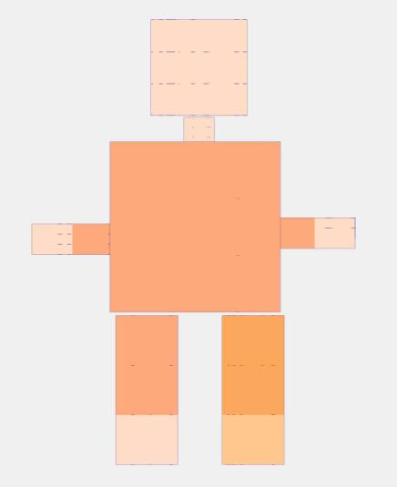

# 3D Model Viewer

A modern, responsive 3D model viewer built with Three.js. View and interact with 3D models in a beautiful dark-themed interface.



## Features

- **Interactive 3D Viewer** - Rotate, zoom, and pan around 3D models
- **Model Library** - Browse and select from multiple 3D models
- **Auto Rotate** - Toggle automatic rotation for hands-free viewing
- **Wireframe Mode** - Toggle wireframe view to see model structure
- **Fullscreen Support** - View models in fullscreen mode
- **Responsive Design** - Works on desktop, tablet, and mobile (landscape)
- **Modular Architecture** - Easy to add new models

## Models Included

| Model | Type | Description |
|-------|------|-------------|
| 🤖 Robot | Character | A friendly geometric robot |
| 🛡️ Tank | Vehicle | Military battle tank with machine gun |
| 🧊 Cube | Primitive | Simple cube geometry |
| 🔮 Sphere | Primitive | Smooth sphere geometry |
| 🔺 Pyramid | Primitive | Four-sided pyramid |
| ⭕ Torus | Primitive | Donut-shaped geometry |

## Getting Started

### Prerequisites

- A modern web browser (Chrome, Firefox, Safari, Edge)
- A local web server (required for ES modules)

### Running Locally

1. Clone the repository:
```bash
git clone <repository-url>
cd 3d-models
```

2. Start a local server:
```bash
# Using Node.js
npx serve .

# Or using Python
python3 -m http.server 8000
```

3. Open your browser and navigate to `http://localhost:8000` (or the port shown)

## Project Structure

```
3d-models/
├── index.html              # Main HTML file
├── css/
│   └── style.css           # Styles and responsive design
├── src/
│   ├── main.js             # Main application logic
│   └── models/
│       ├── index.js        # Model registry factory
│       ├── robot.js        # Robot model
│       ├── tank.js         # Tank model
│       ├── cube.js         # Cube model
│       ├── sphere.js       # Sphere model
│       ├── pyramid.js      # Pyramid model
│       └── torus.js        # Torus model
├── sample.jpg              # Sample image
└── README.md               # This file
```

## Adding New Models

1. Create a new model file in `src/models/`:

```javascript
// src/models/mymodel.js
import * as THREE from 'three';

export const myModel = {
    id: 'mymodel',
    name: 'My Model',
    icon: '🎯',
    type: 'Custom',
    description: 'My custom 3D model',
    partCount: 1,
    
    create(meshes) {
        const geometry = new THREE.BoxGeometry(2, 2, 2);
        const material = new THREE.MeshStandardMaterial({ color: 0xff0000 });
        const mesh = new THREE.Mesh(geometry, material);
        mesh.castShadow = true;
        meshes.push(mesh);
        return mesh;
    }
};
```

2. Register the model in `src/models/index.js`:

```javascript
import { myModel } from './mymodel.js';

const models = [
    // ... existing models
    myModel
];
```

3. Refresh the browser - your model will appear in the list!

## Controls

| Control | Action |
|---------|--------|
| Left-click + Drag | Rotate camera |
| Scroll | Zoom in/out |
| Right-click + Drag | Pan camera |
| Auto Rotate toggle | Enable/disable auto rotation |
| Wireframe toggle | Show/hide wireframe |
| Reset View button | Reset camera position |
| Fullscreen button | Toggle fullscreen mode |

## Technologies

- [Three.js](https://threejs.org/) - 3D graphics library
- [Outfit Font](https://fonts.google.com/specimen/Outfit) - Typography
- Vanilla JavaScript (ES Modules)
- CSS3 with CSS Variables

## Browser Support

- Chrome 89+
- Firefox 89+
- Safari 15+
- Edge 89+

## License

Copyright © 2025 Monk Journey Team. All Rights Reserved.

This project is proprietary and confidential. Unauthorized reproduction, distribution, or disclosure is prohibited. No license, express or implied, to any intellectual property rights is granted by this document.

See the [LICENSE](LICENSE) file for full details.

